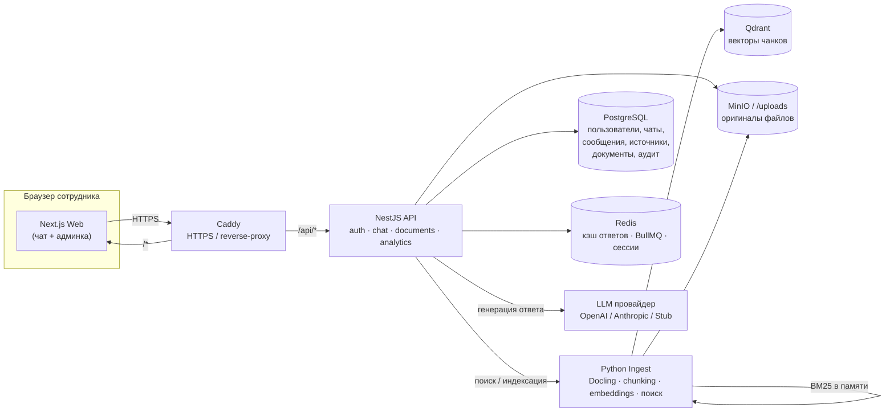
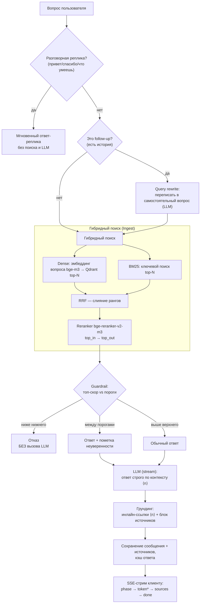
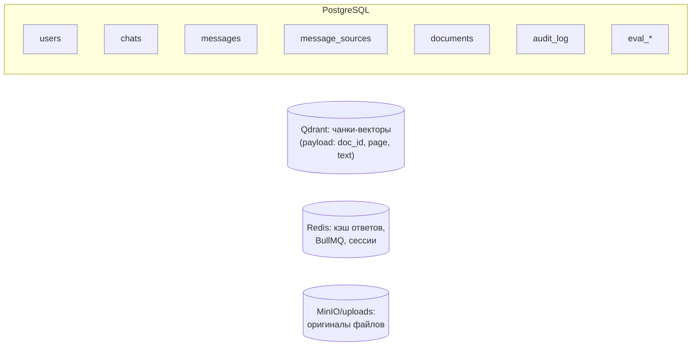
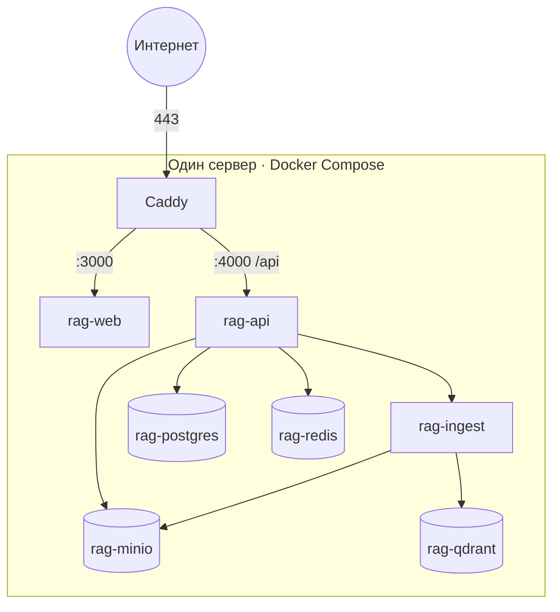
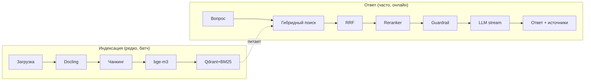

# 07 — Полное описание проекта (для анализа и диаграмм)

Документ описывает продукт целиком: назначение, архитектуру, как обрабатываются
файлы, как формируется ответ, какие механизмы задействованы и пошаговый ход
каждого процесса. Диаграммы даны в формате **Mermaid** (рендерятся в GitHub и
большинстве инструментов), их можно взять за основу для графиков и схем анализа.

---

## 1. Что это за продукт

**Корпоративный AI-ассистент для Центрального банка Армении (ЦБ РА).** Отвечает на
вопросы сотрудников **строго на основе внутренних документов** организации (PDF,
DOCX, XLSX), на **армянском языке**, и в каждом ответе приводит **источники**
(документ, страница; для Excel — лист и строка).

Ключевые принципы:
- **Grounded-only.** Ассистент не «фантазирует»: если в документах нет ответа —
  честно отказывается, не вызывая LLM.
- **Доверие видно.** Источник — часть ответа, а не сноска.
- **Двухпороговый guardrail** уверенности (уверенно / с пометкой неуверенности /
  отказ).
- Один централизованный ассистент (не конструктор ботов). База знаний общая для
  всех сотрудников (в v1 без разграничения доступа к документам).

Масштаб: 200–1000 пользователей, до 100 документов, обновление еженедельно.

---

## 2. Технологический стек

| Слой | Технологии |
|---|---|
| Frontend | Next.js 15 (App Router), React 19, TypeScript strict, Tailwind CSS v4, shadcn/ui |
| Backend (API) | NestJS + Fastify, TypeScript strict |
| Сервис обработки документов | Python + FastAPI, **Docling** (парсинг) |
| Эмбеддинги | **bge-m3** (мультиязычная, 1024-мерная; self-hosted CPU) |
| Векторная БД | **Qdrant** |
| Полнотекстовый поиск | **BM25** (армянский анализ) |
| Reranker | **bge-reranker-v2-m3** (кросс-энкодер; ONNX-int8 или torch) |
| LLM | OpenAI / Anthropic (через fetch) или **Stub** (черновик без токенов) |
| БД / кэш / очереди | PostgreSQL 16, Redis, BullMQ |
| Хранилище файлов | S3-совместимое (MinIO) + том `/uploads` |
| Инфраструктура | Docker Compose, Caddy (HTTPS) |

Монорепозиторий (pnpm workspaces):
```
apps/web      — Next.js: чат сотрудника + админ-панель
apps/api      — NestJS: auth, documents, chat, analytics, audit, eval
apps/ingest   — Python FastAPI: Docling, chunking, embeddings, поиск
packages/shared — общие типы/DTO (Zod), контракты API
packages/ui     — обёртки shadcn, дизайн-токены
```

---

## 3. Архитектура компонентов



Разделение ответственности:
- **API (NestJS)** — оркестратор: auth/RBAC, хранение чатов/сообщений/документов,
  guardrail, вызов LLM, кэш, стриминг ответа клиенту.
- **Ingest (Python)** — «тяжёлый» AI-слой: парсинг документов, нарезка на чанки,
  эмбеддинги, гибридный поиск и реранжирование. Отделён, т.к. это Python-экосистема
  (Docling, torch, onnxruntime) и главный потребитель CPU.

---

## 4. Обработка файлов — конвейер индексации (ingestion)

Что происходит от загрузки документа до готовности к поиску.

```mermaid
sequenceDiagram
  actor Admin as Админ
  participant Web
  participant API as NestJS API
  participant S3 as MinIO/uploads
  participant Q as BullMQ (Redis)
  participant ING as Ingest (Python)
  participant Docling
  participant Emb as bge-m3
  participant QD as Qdrant
  participant PG as PostgreSQL

  Admin->>Web: Загрузка файла (PDF/DOCX/XLSX) + название
  Web->>API: POST /admin/documents/upload (multipart)
  API->>S3: сохранить оригинал
  API->>PG: создать Document (status=queued)
  API->>Q: поставить задачу индексации
  Q->>API: воркер берёт задачу (status=processing)
  API->>ING: POST /ingest-path (путь к файлу)
  ING->>Docling: convert() — парсинг в разметку
  Note over Docling: OCR off (цифровые PDF)\nTableFormer=FAST (скорость на CPU)
  Docling-->>ING: markdown документа
  ING->>ING: chunking (нарезка на фрагменты)
  Note over ING: размер по токенайзеру bge-m3;\nтаблицы разбиваются построчно
  ING->>Emb: embed(chunks) → векторы 1024
  ING->>QD: upsert векторов (+ метаданные)
  ING->>ING: обновить BM25-индекс
  ING-->>API: chunk_count, метаданные
  API->>PG: Document status=ready, chunkCount, indexedAt
  API->>Redis: инвалидация кэша (kb:version++)
```

Пошагово:
1. **Загрузка.** Админ загружает файл; API кладёт оригинал в хранилище и создаёт
   запись `Document` со статусом `queued`.
2. **Очередь.** Задача индексации ставится в BullMQ (Redis); воркер переводит
   документ в `processing`.
3. **Парсинг (Docling).** Документ конвертируется в разметку. OCR выключен (PDF
   цифровые), таблицы — в режиме `FAST` (иначе на CPU обработка занимает десятки
   минут). Для XLSX — отдельный путь: строки листа → фрагменты (лист + номер строки).
4. **Чанкинг.** Текст режется на фрагменты, размер которых считается **токенайзером
   bge-m3** (важно: обычные токенайзеры завышают длину армянского в 9–16 раз).
   Таблицы разбиваются построчно, чтобы факт из строки попадал в отдельный чанк.
5. **Эмбеддинги.** Каждый чанк кодируется в вектор **1024** модели bge-m3.
6. **Хранение.** Векторы + метаданные (document_id, страница/лист/строка, текст)
   пишутся в **Qdrant**; параллельно поддерживается **BM25**-индекс для
   ключевого поиска.
7. **Готовность.** API проставляет `status=ready`, число чанков и время индексации;
   кэш ответов инвалидируется (версия базы знаний растёт).

Статусы документа: `queued → processing → ready` (или `failed` с текстом ошибки).
Админка опрашивает статус и показывает бейджи; поддержаны переиндексация и удаление
(с очисткой векторов и кэша).

---

## 5. Ответ ассистента — RAG-конвейер (query pipeline)

Что происходит от вопроса пользователя до ответа с источниками.



Пошагово:
1. **Разговорный роутер.** Если вопрос — приветствие/благодарность/прощание/«что
   умеешь», ассистент отвечает готовой репликой **мгновенно, без поиска и LLM**
   (0 токенов). Всё остальное идёт в RAG.
2. **Query rewrite (для follow-up).** Если в чате есть история, уточняющий вопрос
   («а минимальная?») переписывается LLM в самостоятельный запрос — иначе поиск
   ищет по обрывку. Первый вопрос чата идёт как есть. (Перф-оптимизация: rewrite и
   «оптимистичный» поиск по сырому вопросу выполняются параллельно.)
3. **Гибридный поиск.** Параллельно: **dense** (эмбеддинг вопроса bge-m3 → близкие
   векторы в Qdrant) и **BM25** (ключевой поиск). Результаты сливаются алгоритмом
   **RRF** (Reciprocal Rank Fusion).
4. **Reranking.** Кросс-энкодер **bge-reranker-v2-m3** переоценивает `top_in`
   кандидатов и оставляет `top_out` наиболее релевантных. Это главный источник
   качества (и главный потребитель CPU).
5. **Guardrail (двухпороговый).** По верхнему скору reranker'а:
   - **ниже `THRESHOLD_LOW`** → отказ «ответ не найден», **LLM не вызывается**;
   - **между порогами** → ответ с пометкой «может быть неполным»;
   - **выше `THRESHOLD_HIGH`** → обычный ответ.
6. **Генерация (LLM, стриминг).** LLM получает вопрос + найденные фрагменты с
   маркерами ⟨1⟩⟨2⟩… и генерирует ответ **строго по контексту**, ссылаясь на
   маркеры. Токены стримятся пользователю по мере генерации (низкий TTFT).
   Провайдер конфигурируем: OpenAI / Anthropic / **Stub** (черновик из фрагментов
   без вызова платного API).
7. **Грундинг и источники.** Маркеры в тексте превращаются в кликабельные ссылки
   ⟨n⟩; формируется блок источников (документ, страница). Клик по источнику
   открывает встроенный просмотр документа.
8. **Сохранение и кэш.** Сообщение, источники и токен-метрики пишутся в Postgres;
   ответ кладётся в **кэш Redis** (ключ — нормализованный вопрос; сбрасывается при
   изменении базы знаний).

Формат стрима (SSE-события): `phase` (режим: поиск/реплика) → `token` (дельты
текста) → `sources` (после генерации) → `done` (id сообщения + уровень уверенности).

---

## 6. Ключевые механизмы (кратко, для схем)

| Механизм | Суть | Зачем |
|---|---|---|
| bge-m3 эмбеддинги (1024) | мультиязычные векторы, self-hosted CPU | семантический поиск на армянском |
| Гибридный поиск + RRF | dense (смысл) + BM25 (точные слова) → слияние рангов | не терять ни синонимы, ни термины/номера |
| Reranker (кросс-энкодер) | попарная переоценка вопрос–фрагмент | резкий рост точности top-результатов |
| Двухпороговый guardrail | скор reranker'а vs 2 порога | честный отказ / пометка неуверенности |
| Query rewrite | follow-up → самостоятельный вопрос (LLM) | диалог с контекстом |
| Разговорный роутер | приветствия и т.п. без поиска/LLM | естественность, 0 токенов |
| Стриминг (SSE) | токены по мере генерации | низкая воспринимаемая задержка |
| Грундинг/цитаты ⟨n⟩ | привязка ответа к фрагментам | проверяемость, доверие |
| Кэш ответов (Redis) | нормализованный вопрос → ответ; версия базы | скорость и экономия |
| Токен-метрики + аудит | учёт in/out токенов, лог админ-действий | аналитика, комплаенс |

---

## 7. Данные и хранилища



- **PostgreSQL** — источник истины: пользователи/роли, чаты и сообщения, источники
  сообщений (FK на документы), реестр документов, журнал аудита, наборы для
  оценки качества (eval).
- **Qdrant** — векторы чанков + метаданные (для dense-поиска).
- **Redis** — кэш ответов, очереди BullMQ (индексация), сессии.
- **MinIO / том `/uploads`** — оригиналы файлов (просмотр/скачивание в UI).

Консистентность: при удалении/переиндексации документа чистятся его векторы в
Qdrant и кэш ответов; источники старых сообщений остаются валидными по FK.

---

## 8. Роли, безопасность, наблюдаемость

- **Аутентификация** — JWT (access + refresh).
- **RBAC** — роли `admin` (управление документами/пользователями/аналитикой) и
  `client` (чат). Порядок guard'ов: JWT → Throttler → Roles (rate-limit
  per-user, а не per-IP — важно за NAT).
- **Rate limiting** — ограничение запросов в минуту на пользователя.
- **Аудит** — админ-действия пишутся в `audit_log` (кто, что, когда).
- **Guardrails контента** — grounded-only, отказ без LLM ниже порога, обязательные
  источники.

---

## 9. Развёртывание



- Целевая среда — **один сервер + Docker Compose** (профиль `app`), без Kubernetes.
- HTTPS — контейнер **Caddy** с авто-Let's Encrypt (`/api/*` → API, остальное → web).
- Наружу открыты только 22/80/443; внутренние порты закрыты firewall.
- Первый запуск API сам применяет миграции и создаёт seed-админа; Ingest при
  первом обращении подгружает модели (bge-m3, reranker) в том.
- Подробный ранбук — `docs/06-DEPLOY.md`.

---

## 10. Производительность и ограничения

- **Приоритет проекта — скорость ответов** (цель TTFT p95 ≤ ~4 с на целевом
  сервере). Достигается стримингом, кэшем, параллелизмом rewrite∥поиск,
  ограничением числа кандидатов reranker'а (`RERANK_TOP_IN`).
- **Reranker — главный потребитель CPU.** На слабой машине (напр. 4 общих vCPU)
  один поиск с torch-reranker'ом занимает ~40–45 с — это узкое место. Ускорение:
  ONNX-int8 reranker (2–4×), уменьшение `RERANK_TOP_IN`, больше/быстрее CPU.
- **Docling на CPU** чувствителен к режиму таблиц: `ACCURATE` может занимать десятки
  минут на документ → используется `FAST`.
- **Индексация большого документа** (~1000+ чанков) на 4 vCPU — 15–20 мин
  (эмбеддинг на CPU); это нормально для еженедельного обновления базы.
- **Stub-LLM** отдаёт черновой ответ из найденных фрагментов (0 токенов) — для
  боевых формулировок подключается OpenAI/Anthropic ключом.

---

## 11. Сводные потоки (для верхнеуровневой схемы анализа)



Эти две «дорожки» — основа для диаграмм анализа: одна редкая и ресурсоёмкая
(наполнение базы знаний), вторая частая и латентно-критичная (ответ пользователю).
